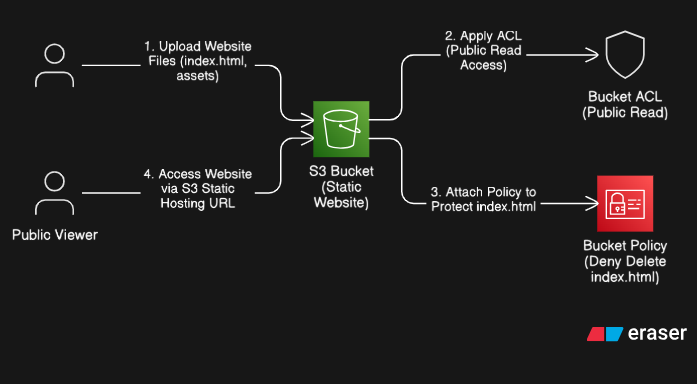
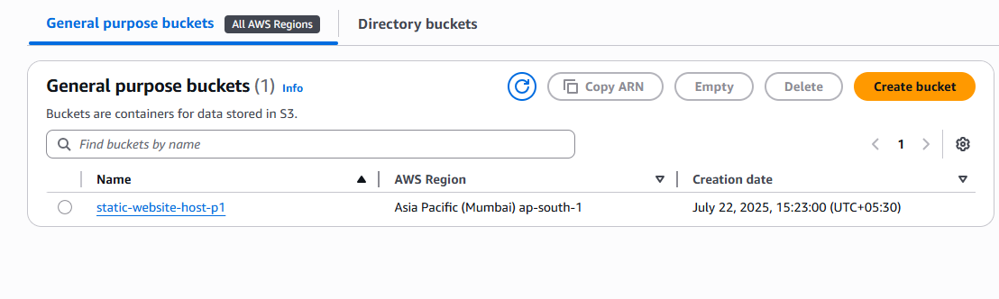
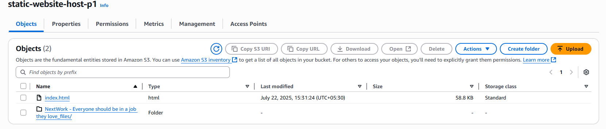
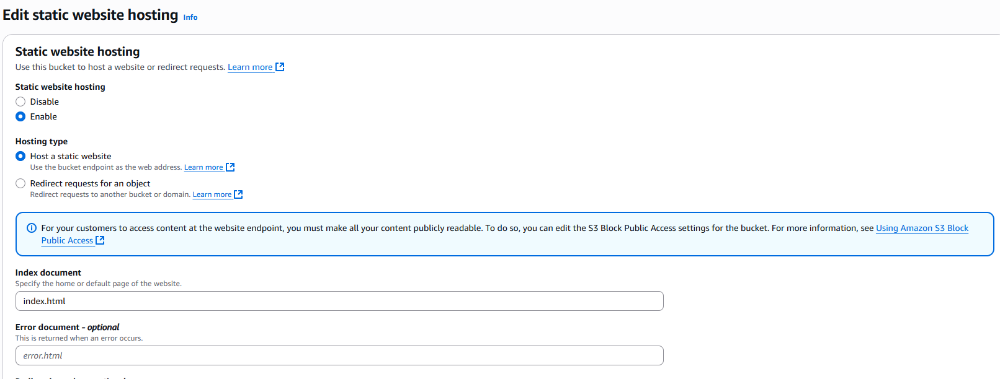
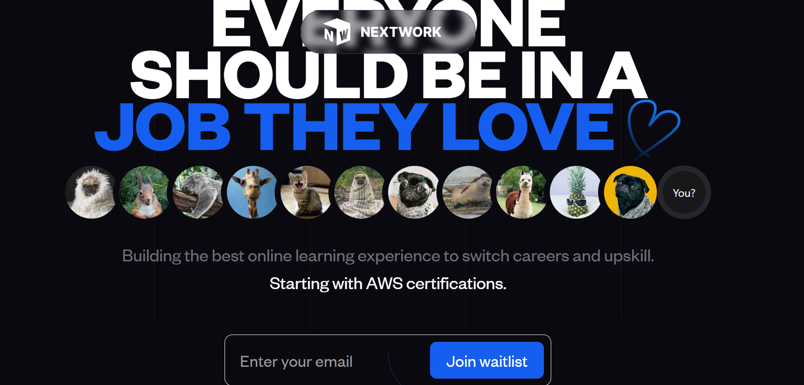

# AWS S3 Static Website Hosting with ACL & Bucket Policy

---

## 📌 Project Overview
This project demonstrates static website hosting on Amazon S3 with object-level ACLs and bucket policies for secure access control and protection of critical files like `index.html`.

### Key Highlights
- Hosted a static website on an Amazon S3 bucket.  
- Enabled ACLs to allow public read access for website files.  
- Applied a bucket policy to prevent deletion of `index.html`.  
- Troubleshot public access issues commonly faced during S3 hosting.  

---

## 🎯 Why These AWS Services?

### Amazon S3
- **Why S3?**  
  - Highly durable, globally distributed storage (99.999999999% durability).  
  - No server maintenance compared to traditional hosting servers.  
- **Why not Azure Blob or Google Cloud Storage?**  
  - Seamless integration with the AWS ecosystem (IAM, CloudFront, Route53).  
  - Simplified pricing and configuration for static websites.

### ACL (Access Control List)
- **Why ACL?**  
  - Provides object-level permissions essential for public access.  
- **Why not IAM alone?**  
  - IAM manages AWS user permissions but cannot directly control public object access.

### Bucket Policy
- **Why Bucket Policy?**  
  - Allows explicit deny rules, such as preventing deletion of specific files.  
- **Why not ACL alone?**  
  - ACLs cannot enforce fine-grained deny rules.

---

## 🔧 Tech Stack

| Service/Tool         | Purpose                                      |
|----------------------|----------------------------------------------|
| Amazon S3            | Host static website content                  |
| Bucket ACL           | Enable public read for website files         |
| Bucket Policy        | Protect critical files like `index.html`     |
| AWS Console Skills   | Configuration, troubleshooting, and debugging |

---

## 🏗 Architecture

[View Eraser.io Code](architecture/architecture.eraser)

---

📝 Bucket Policy Example
policies/s3policy.txt

{
    "Version": "2012-10-17",
    "Statement": [
        {
            "Sid": "Statement1",
            "Effect": "Deny",
            "Principal": "*",
            "Action": "s3:DeleteObject",
            "Resource": "arn:aws:s3:::static-website-host-p1/index.html"
        }
    ]
}

📸 Project Screenshots
1. S3 Bucket Creation
    

2. Uploading Website Files
    

3. Enabling Static Website Hosting
    

4. Live Hosted Webpage
    

##🚀 How to Reproduce This Project
Create an S3 bucket with ACL: Bucket Owner Preferred.

Disable Block Public Access in bucket settings.

Upload website files (website/index.html and assets).

Enable Static Website Hosting in S3 bucket properties.

Set public-read ACL on objects to allow public access.

Attach a bucket policy to prevent deletion of index.html.

##🎓 Key Learning Outcomes
Understood the difference between ACLs and bucket policies for fine-grained access control.

Learned to troubleshoot common S3 public access and hosting issues.

Gained hands-on experience in secure static website hosting using AWS.

## Upgrade Idea
Add CloudFront CDN for HTTPS and better caching.

Automate deployment using AWS CLI or Terraform.

##License
This project is licensed under the MIT License.

##What You Need to Do
Copy this content as-is into your README.md.

Save and commit.

Would you like me to add a "Features + Future Improvements" section and a "Contact Me" section so your repo looks like a showcase portfolio project on GitHub?
